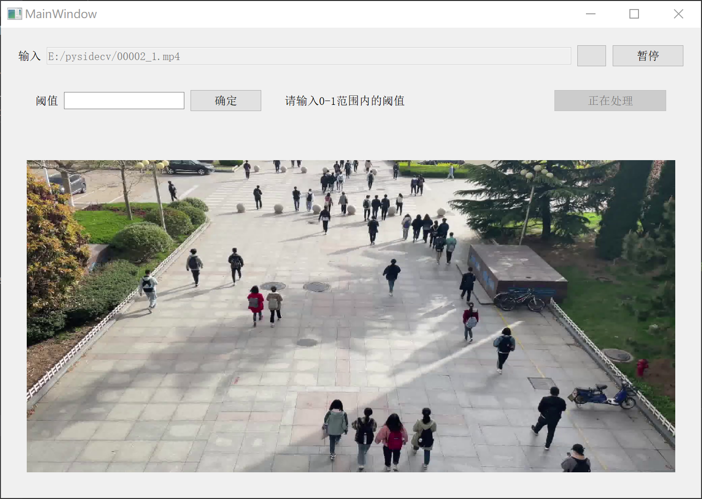
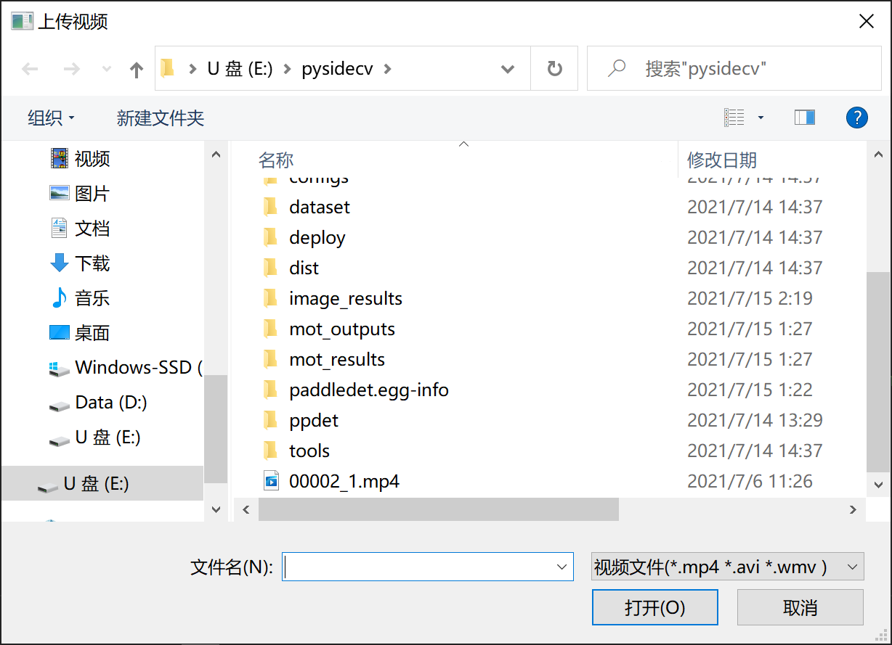
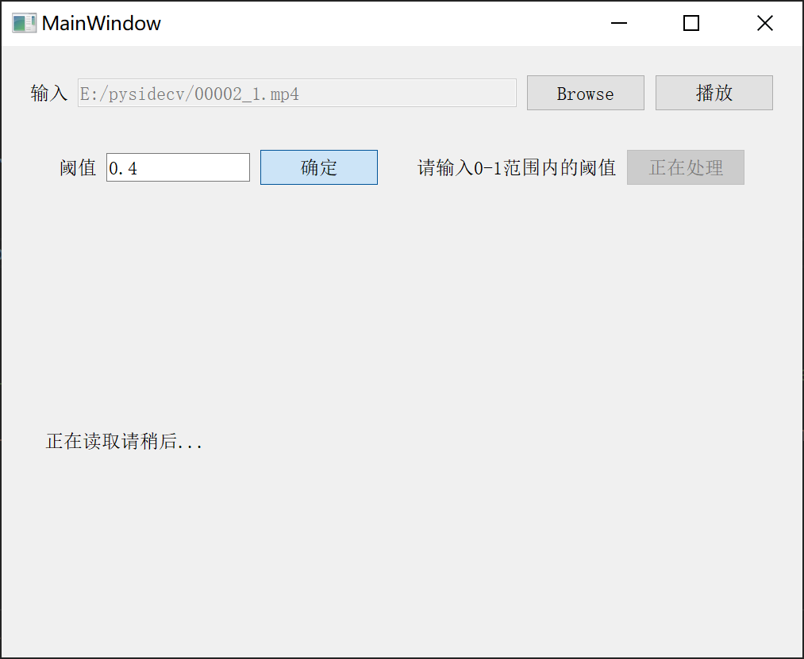
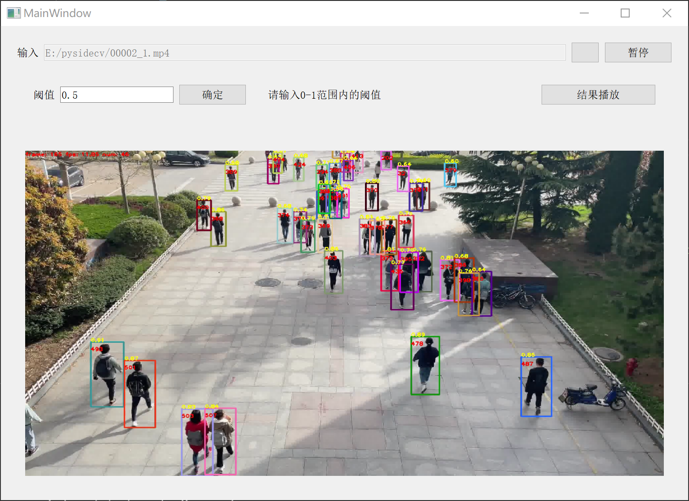

# 基于Fairmot的多目标追踪UI界面构建
本作品为基于[paddleDetection](https://github.com/PaddlePaddle/PaddleDetection)开发套件建立起来的多目标追踪平台

<div align="center">
  
</div>

## 安装
### 系统要求
```
CUDA==10.1
cuDNN==7.6
```
### 一键安装
``` bash
python install.py
```

## 运行
双击main.py或输入命令行启动
``` bash
python main.py
```
### 选择视频
点击Browse按钮，即可进入选择视频界面
<div align="center">
  
</div>

### 设置阈值
在阈值设置那一块儿输入阈值后点击“确定”，即可开始运行
<div align="center">
  
</div>

### 完成推理，输出视频
在推理完成后，点击查看结果即可播放结果视频
<div align="center">
  
</div>

## 引用
```
@misc{ppdet2019,
title={PaddleDetection, Object detection and instance segmentation toolkit based on PaddlePaddle.},
author={PaddlePaddle Authors},
howpublished = {\url{https://github.com/PaddlePaddle/PaddleDetection}},
year={2019}
}
```
